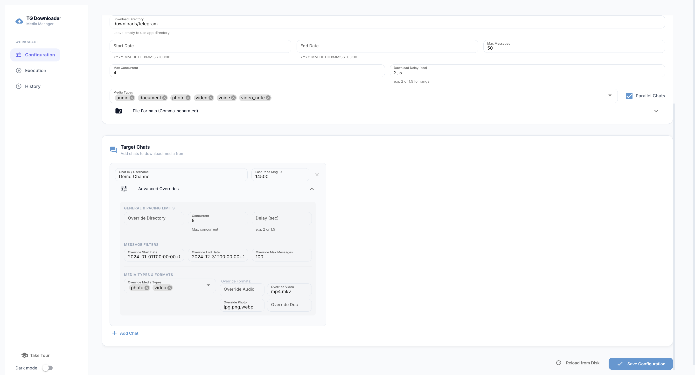
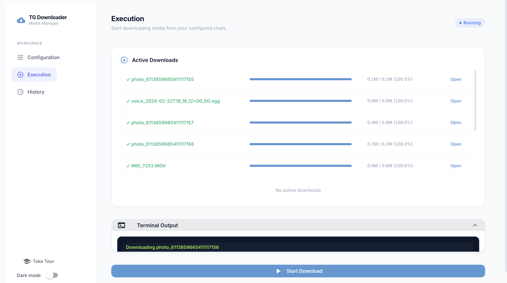
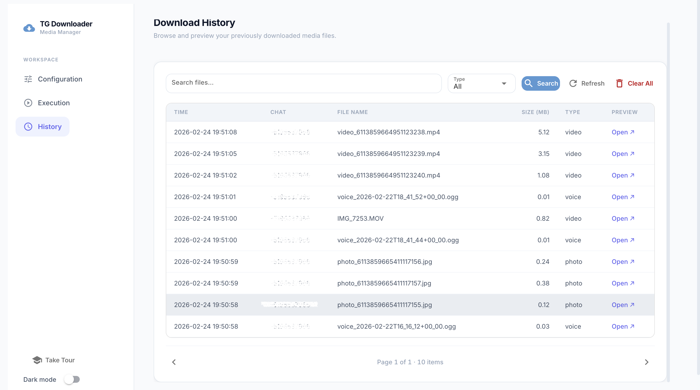

# Getting Started with the Web UI

Telegram Media Downloader now features an interactive, graphical Web Interface (powered by NiceGUI) for users who prefer visual configuration over editing YAML files, or those who want to track their download progress in real-time.

---

## 🚀 Installation

To keep the core application lightweight, the Web UI components are an **optional installation**. You must have Python 3.10 or higher.

1. **Clone the repository:**
   ```sh
   git clone https://github.com/Dineshkarthik/telegram_media_downloader.git
   cd telegram_media_downloader
   ```

2. **Install the Web UI dependencies:**

   If you are on a *nix OS (Linux/macOS):
   ```sh
   make install_webui
   ```

   If you are on Windows (or don't have `make` installed):
   ```sh
   pip3 install -r requirements-webui.txt
   ```

---

## 🖥️ Running the Web UI

Once the dependencies are installed, you can start the Web UI by running:
```sh
python3 webui.py
```
This will start a local web server (typically at `http://localhost:8080`). Open that URL in your web browser to access the interface.

---

## 📑 Feature Overview

The Web UI is split into three main tabs accessible from the left sidebar: **Configuration**, **Execution**, and **History**.

### 1. Configuration Tab
The Configuration tab allows you to set all your global and chat-specific download rules visually without ever touching `config.yaml`.

* **Global Settings:** Configure your API credentials, rate limiting (delay/concurrency), default formats, and directories.
* **Target Chats:** Add as many chats as you want to scrape from.
* **Advanced Overrides:** Clicking **"Advanced Overrides"** on any specific chat reveals semantic containers allowing you to override global settings. You can throttle the bandwidth differently for specific channels, filter older messages, or only extract specific file extensions (like `heic,webp`).



### 2. Execution Tab
The Execution tab is your control center for starting the actual download jobs.

* Ensure you've hit "Save Configuration" in the Configuration tab first.
* Click **"Start Download"**.
* The console will start streaming live terminal output directly into your browser.
* You can follow the progress of individual downloads, including concurrency and delay execution.
* An interactive popup is available to preview media in real-time as it safely writes to your disk.



### 3. History Tab
The History tab lets you search and examine previously downloaded media files.

* The table provides `TIME`, `CHAT`, `FILE NAME`, `SIZE`, and `TYPE` metadata.
* Use the embedded search bar to quickly locate files across large repositories.
* Clicking the **Preview** button on any compatible media (like videos, audio, images or PDFs) opens a maximized modal letting you view the content without leaving the browser.



---

### 🎨 Customization
* **Dark Mode:** Use the toggle at the bottom-left of the sidebar to switch between light and dark themes based on your preference.
* **Take Tour:** If you ever need a quick refresher on where things are, click the "Take Tour" button to interactively highlight each component.
